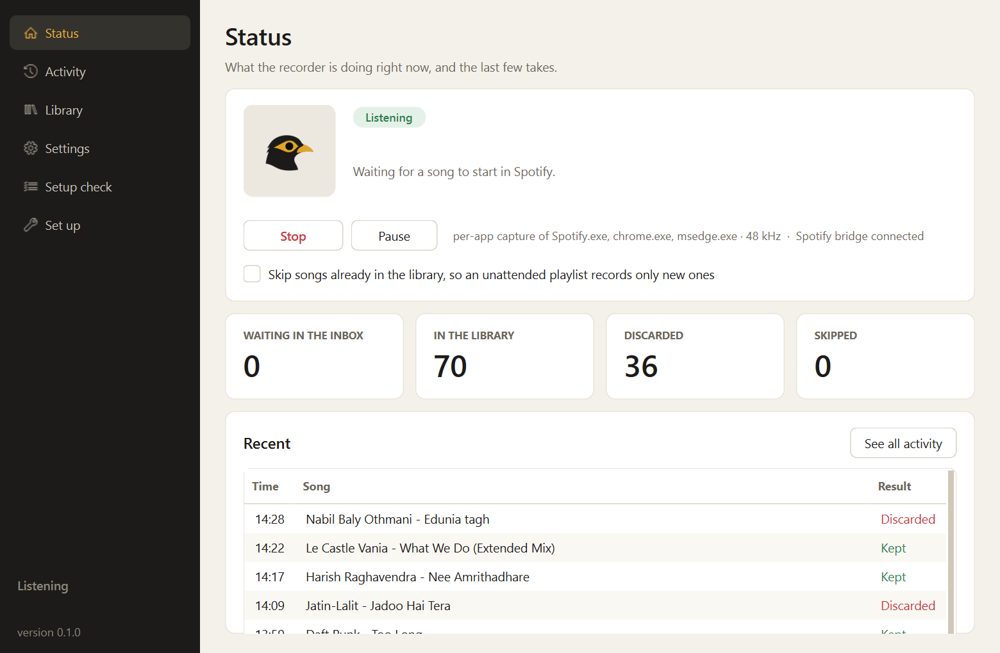
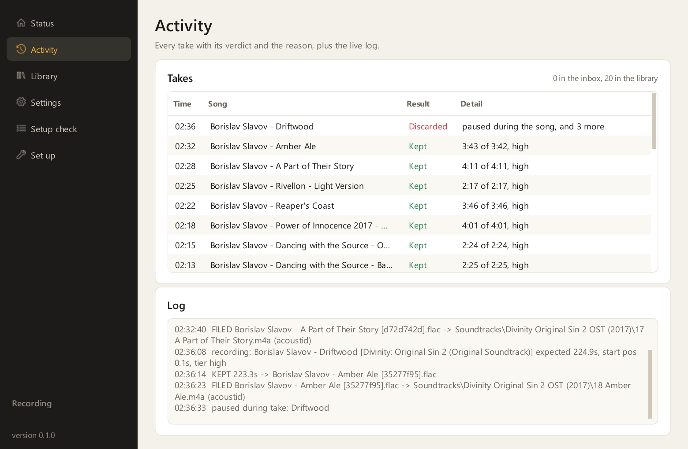
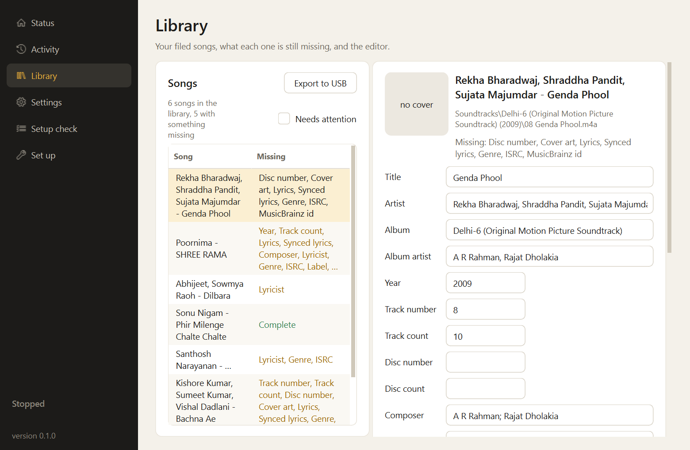

# Mynaphone

Keeps a private, properly tagged copy of the songs you play on your Windows PC, so you can listen
when the internet is down.

Mynaphone runs in the system tray. When a song plays in Spotify, or in YouTube Music in Chrome
(through a small browser extension that comes in this repository), it records that app's own audio
and keeps the recording only if it captured the whole song cleanly.

Then it finds out which song it was, using a free AcoustID key you register once, adds lyrics and
cover art, and files it as an AAC file in a folder layout you can copy to a phone or to a USB stick
for the car.

The name is [myna plus gramophone](docs/name.md). The myna is the Indian bird that repeats whatever
it hears.

## What it does



- Records per app, so notifications and other programs never end up in a recording.
- Keeps a take only when the song played from the first second to the last, with no pause, seek,
  stall or dropout. Anything else is discarded and the reason is written down.
- Identifies each song by acoustic fingerprint through AcoustID and MusicBrainz, and fills in artist,
  album, year, track number, composer, singers, label, ISRC and more. This needs the free AcoustID
  key; without it, songs are filed with the tags Spotify reported.
- Adds synced lyrics and cover art. Spotify's own lyrics arrive through the optional Spotify bridge,
  which needs Spicetify; LRCLIB supplies the rest with no setup.
- Files songs as `Soundtracks/<Album (Year)>/<NN Title>.m4a` or `Artists/<Artist>/<Album>/...`, with
  singers in the artist tag and the music director as album artist and composer.
- Skips any song it already has, unless the song is now playing at a higher quality tier.
- Remembers which metadata is still missing for every song, retries on its own, and lets you fill
  in the rest by hand.
- Records and verifies without internet. Lookups wait for the connection to come back.

| Every take and why it was kept or discarded | Each song's missing details beside the editor |
|---|---|
|  |  |

## Things it never does

- Download files from Spotify, YouTube or anywhere else.
- Decrypt, bypass or remove copy protection of any kind. It records the sound Windows is already
  sending to your speakers, the same way a screen recorder does.
- Share anything. It has no accounts, no cloud and no upload feature. Everything stays on your PC.

## Services, formats and players it works with

| | Supported today | Notes |
|---|---|---|
| Music sources | Spotify desktop app; YouTube and YouTube Music in Chrome or Edge with the bundled browser extension | Any other Windows app that reports what it plays can be added by process name, untested |
| Spotify plans | Free, Premium, Premium with lossless | The recording matches the plan's stream quality; lossless captures stay FLAC |
| Output formats | AAC (default), MP3, Opus, FLAC | Full tags, cover art and lyrics in every format |
| Players for the result | Car head units, iPhone, Android, any computer; foobar2000, MusicBee, Poweramp, Navidrome, Jellyfin, Plex | Synced lyrics are embedded and also saved as `.lrc` files |
| Metadata sources | AcoustID, MusicBrainz, Spotify, YouTube Music, LRCLIB, Cover Art Archive | All free; AcoustID needs a free application key |

## System requirements

| | Minimum |
|---|---|
| Windows | 10 version 2004 (build 19041) or later, or Windows 11, 64-bit |
| Python | 3.11 or later |
| Processor and memory | Any PC that runs Spotify comfortably. Measured on the author's laptop: under 1 % of the CPU while listening, about 500 MB of memory with the window open |
| Disk | About 9 MB per archived song as AAC, 30 MB as FLAC, plus 2 GB of working space; 5,000 songs need about 45 GB |
| Audio | Any output device; the recording does not depend on your speakers or the Windows volume |
| Network | Needed only for identification, lyrics and cover art, about 100 KB per song; recording works offline |
| Optional | Spicetify for the Spotify bridge (exact ids, quality tier, Spotify's lyrics); Chrome or Edge with the bundled extension for YouTube |

macOS and Linux are not supported, because per-app audio capture and the media-session data the
recorder depends on are Windows features. The library it produces plays on any device.

## Install

1. Install Python 3.11 or later from python.org, ticking "Add Python to PATH".
2. Download or clone this repository, for example to `D:\Mynaphone`.
3. In PowerShell, inside that folder, run these 3 commands:

   ```powershell
   python -m venv .venv
   .\.venv\Scripts\pip install -e .
   .\.venv\Scripts\python -m mynaphone setup-tools
   ```

   The last one downloads ffmpeg and Chromaprint into the `tools` folder and builds the small
   capture helper with the C# compiler that comes with Windows. No administrator rights are needed.
4. Copy `config.example.toml` to `config.toml`.
5. Start the app:

   ```powershell
   .\.venv\Scripts\python -m mynaphone gui
   ```

   It opens on a **Set up** page that walks you through the rest: the free AcoustID key, the library
   folder with an estimate of how many songs fit, and the optional Spotify and browser bridges.

The [install guide](docs/install.md) has every step with screenshots' worth of detail.

## Quick start

1. Open Mynaphone and go to **Setup check**. Select **Run checks** and fix anything marked Problem.
2. In Spotify, set **Streaming quality** to a fixed value rather than Automatic, and switch
   **Normalize volume**, **Crossfade** and **Automix** off. The Setup check page lists these.
3. On the **Status** page, select **Start**. The tray icon's dot turns red while a song records.
4. Play a song in Spotify from its beginning and let it finish.
5. Within a minute the song appears on the **Library** page with its tags, and the file is in your
   library folder.

## Documentation

| Page | What you'll find |
|---|---|
| [Install guide](docs/install.md) | Setup step by step, the AcoustID key, the Spotify and browser bridges, updating, uninstalling |
| [Using Mynaphone](docs/using.md) | Everyday tasks: recording, harvest mode, fixing a song's details, exporting to USB |
| [Settings reference](docs/settings.md) | Every setting, its default and what it changes |
| [How it works](docs/how-it-works.md) | The capture pipeline, the keep-or-discard rules, identification, what goes over the network |
| [Troubleshooting guide](docs/troubleshooting.md) | Symptoms, causes and fixes, and where the logs are |
| [Questions and answers](docs/faq.md) | Quality, account safety, formats, devices, privacy, comparisons with other tools |
| [Security and privacy](docs/security.md) | What the app can reach, what it sends, and how to report a vulnerability |
| [Legal notice](docs/legal.md) | What the app does and doesn't do, and what you are responsible for |
| [Design research](docs/research.md) | The survey of existing tools and techniques the design came from |
| [Where the name comes from](docs/name.md) | The myna, the gramophone, and what each one has to do with the app |

## Intended use and legal notice

Mynaphone records the audio that your own computer is already playing, through Windows' per-app
audio capture. It does not download files from any service, does not remove or bypass encryption
or any other copy protection, and does not share anything with anyone.

It is built for one person keeping a private copy of music they listen to, on their own machine, for
their own listening.

Whether making such a copy is permitted depends on where you live and on the terms of the services
you use. Some services' terms prohibit recording or ripping their streams.

You are responsible for checking the law and the terms that apply to you before you use Mynaphone,
and for what you do with the recordings. Don't share, upload, sell or redistribute them.

Mynaphone is an independent open-source project with no connection to Spotify, YouTube, Google,
MusicBrainz, AcoustID or LRCLIB. Those names are trademarks of their owners and appear here only to
say which services the app works with.

The software comes without warranty of any kind, as the [GPL license text](LICENSE) and the
[legal notice](docs/legal.md) explain.

## Contributing and support

Bug reports and ideas are welcome as GitHub issues. The [contributing guide](CONTRIBUTING.md)
explains how to set up a development environment, run the tests, and which kinds of changes will
not be merged.

## License

Mynaphone is free software under the GNU General Public License, version 3 or later. You may use,
study, share and improve it, and a modified version you distribute must come with its source under
the same terms. The components it builds on, among them ffmpeg, Chromaprint, Qt through PySide6 and
mutagen, have their own compatible licenses, listed in the [third-party notices](THIRD_PARTY_NOTICES.md).
You may reuse the documentation under CC BY 4.0.

## Acknowledgements

Song identification uses the open [MusicBrainz database](https://musicbrainz.org) and the
[AcoustID service](https://acoustid.org). Lyrics come from [the LRCLIB project](https://lrclib.net).
Encoding uses [the FFmpeg project](https://ffmpeg.org) and fingerprinting uses
[the Chromaprint library](https://acoustid.org/chromaprint). The interface is built with Qt through PySide6.
