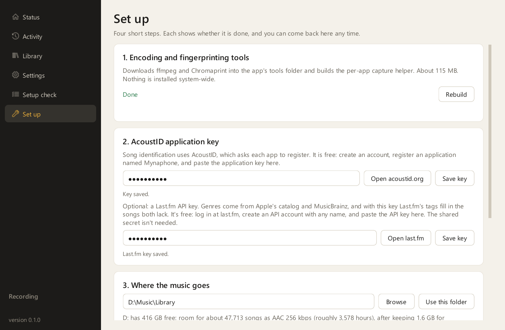

# Install Mynaphone

This page takes you from nothing to a running recorder. Allow 15 minutes, more on a slow connection,
because the ffmpeg download is about 115 MB.

Steps 1 to 3 happen in PowerShell. From step 4 on you can do everything inside the app's **Set up**
page instead, and the sections below describe the same steps for anyone who prefers to do them by hand.

## Before you start

Check that you have:

- Windows 10 version 2004 or later, or Windows 11, 64-bit. To check, press <kbd>Win</kbd>+<kbd>R</kbd>,
  type `winver` and press <kbd>Enter</kbd>. Version 2004 is build 19041.
- The Spotify desktop app from [spotify.com/download](https://www.spotify.com/download/windows/), or
  Chrome or Edge for YouTube Music. The Microsoft Store edition of Spotify works for recording, but
  Spicetify can't modify it, so it can't take the Spotify bridge.
- A few gigabytes of free disk space on the drive where you want the library.

## Step 1: Install Python

1. Download Python 3.11 or later from the [Python downloads for Windows](https://www.python.org/downloads/windows/).
2. Run the installer. On the first screen, tick **Add python.exe to PATH**, then select **Install Now**.
3. To confirm, open PowerShell and run `python --version`. It should print 3.11 or higher.

## Step 2: Get the code

Either open the [Mynaphone repository](https://github.com/SalmanRavoof/mynaphone), select
**Code** > **Download ZIP** and unzip it, or, with [Git for Windows](https://git-scm.com/downloads/win)
installed, run:

```powershell
git clone https://github.com/SalmanRavoof/mynaphone.git
```

Put the folder somewhere permanent, for example `D:\Mynaphone`. The app runs from this folder, so
moving it later means running step 3 again.

## Step 3: Create the Python environment and download the tools

1. Open PowerShell in the folder. In File Explorer, type `powershell` in the address bar and press
   <kbd>Enter</kbd>.
2. Run these commands one at a time:

   ```powershell
   python -m venv .venv
   .\.venv\Scripts\pip install -e .
   .\.venv\Scripts\python -m mynaphone setup-tools
   Copy-Item config.example.toml config.toml
   ```

| Command | What it does |
|---|---|
| `python -m venv .venv` | Creates a private Python environment in a `.venv` folder, so nothing else on your PC is touched |
| `pip install -e .` | Installs Mynaphone and its Python dependencies into that environment |
| `mynaphone setup-tools` | Downloads ffmpeg for encoding and Chromaprint for fingerprinting into the `tools` folder, and builds the per-app capture helper with the C# compiler that is part of Windows |
| `Copy-Item config.example.toml config.toml` | Creates your settings file from the example that comes with the code. The app won't start without it |

Nothing is installed system-wide and no administrator prompt should appear.

> [!NOTE]
> If the third command reports that the compiler was not found, the app still works, but it records
> the whole output device instead of one app. [The capture helper won't build](troubleshooting.md#the-capture-helper-wont-build)
> explains what to do.

## Step 4: Start the app and open the Set up page

```powershell
.\.venv\Scripts\python -m mynaphone gui
```

On first run the window opens on the **Set up** page, with a card for each remaining step. Each
card shows Done when it's finished, and the page stays in the sidebar afterwards.



| Card | What it does |
|---|---|
| 1. Encoding and fingerprinting tools | Downloads ffmpeg and Chromaprint and builds the capture helper, if you skipped `setup-tools` in step 3. **Rebuild** runs it again. |
| 2. AcoustID application key | Stores the key from step 5. **Open acoustid.org** opens the registration page. The Last.fm key below it is optional. |
| 3. Where the music goes | Sets the library folder and shows how many songs fit on that drive. |
| 4. Spotify and browser bridges | Installs the Spotify bridge and shows where the browser extension is. Steps 8 and 9 below cover both. |

## Step 5: Register a free AcoustID application key

Mynaphone identifies songs by comparing an acoustic fingerprint against the AcoustID database.
[AcoustID's web service terms](https://acoustid.org/webservice) ask every application to register,
which costs nothing and takes a minute.

1. Create an account on the [AcoustID login page](https://acoustid.org/login).
2. Open your [AcoustID applications list](https://acoustid.org/my-applications) and select
   **Register a new application**.
3. Enter a name, for example `Mynaphone`, and a version, `0.1`, and submit.
4. Copy the **Application API key** shown on the next page.
5. Paste it into card 2 on the **Set up** page and select **Save key**.

Your AcoustID profile page also shows a "user API key". That one is for submitting fingerprints, and
the app doesn't need it.

### Optional: a Last.fm API key for genres

Genres come from Apple's catalog and MusicBrainz, and Last.fm's tags fill in the songs both lack.

1. Log in to Last.fm and open [Create API account](https://www.last.fm/api/account/create).
2. Give it any name and copy the **API key**. The shared secret isn't needed.
3. Paste it into the Last.fm box on the **Set up** page and select **Save key**.

## Step 6, optional: Edit the settings file by hand

The **Set up** and **Settings** pages save what you choose to `config.toml` in the Mynaphone folder.
To make the same changes by hand instead:

1. Quit Mynaphone through the tray icon's **Quit**, so it doesn't overwrite your edits.
2. Open `config.toml` in Notepad.
3. In the `[identify]` section, paste the AcoustID key between the quotes on the `acoustid_key` line,
   and the Last.fm key, if you have one, on the `lastfm_api_key` line.
4. If you want the music somewhere other than `D:\Music\Library`, change the folders in the
   `[paths]` section.
5. Save the file and start Mynaphone again.

`.gitignore` lists `config.toml`, so your keys never end up in a fork you push. The
[settings reference](settings.md) lists every line in the file.

## Step 7: Run the setup check

1. In the sidebar, select **Setup check**.
2. Select **Run checks**. Each line shows OK, Info, Check or Problem, with an explanation.
3. Fix anything marked Problem before recording. The [troubleshooting guide](troubleshooting.md)
   covers each one.


Below the automatic checks, the **Confirm once in Spotify** card lists Spotify settings that can't be
read from outside the app. Open Spotify's **Settings** and set them once:

| Spotify setting | Set it to | Why |
|---|---|---|
| **Audio quality** > **Streaming quality** | A fixed value: High on Free, Very high or Lossless on Premium. Never Automatic | Spotify's [audio quality page](https://support.spotify.com/us/article/audio-quality/) lists about 160 kbit/s for High and 320 kbit/s for Very high. A fixed value keeps every take at one quality |
| **Audio quality** > **Auto adjust quality** | Off | On a weak connection Spotify then stalls, which Mynaphone notices, instead of quietly lowering the quality |
| **Playback** > **Normalize volume** | Off | Normalizing changes the song's level |
| **Playback** > **Crossfade** and **Automix** | Off | Both blend the end of one song into the start of the next |
| **Playback** > **Equalizer** and **Mono audio** | Off | Both change the sound before Mynaphone records it |
| **Autoplay** | Off, unless you want the queue to keep going | Autoplay picks songs you didn't choose |
| **Exclusive Mode**, if shown | Off | Exclusive mode bypasses the point Windows records from |
| Spotify's own volume slider | 100 % | It's applied before the audio reaches Mynaphone. Use the Windows volume for listening level |

## Step 8, recommended: Install the Spotify bridge

The bridge is a small extension for [Spicetify](https://spicetify.app), a free tool that customizes
the Spotify desktop app. With it, Mynaphone gets the exact track id, the quality tier the song played
at, Spotify's own synced lyrics, and buffering and seek information. Without it, Mynaphone still
records from Spotify using the information Windows provides, but some metadata and many lyrics will
be missing.

1. Install Spicetify by following its [getting-started guide](https://spicetify.app/docs/getting-started).
2. In the Mynaphone folder, run:

   ```powershell
   .\.venv\Scripts\python -m mynaphone install-spicetify --apply
   ```

   The command copies `spicetify/mynaphone.js` into Spicetify's `Extensions` folder, enables it and
   runs `spicetify apply`. Spotify restarts once. You can also select **Reinstall** on card 4 of the
   **Set up** page.
3. Select **Start** on the **Status** page. Next to the buttons it should read "Spotify bridge connected".

> [!IMPORTANT]
> Each Spotify update undoes Spicetify. Run `spicetify apply` after an update to put the bridge back.
> The **Setup check** page tells you when the bridge is installed but not connected.

## Step 9, optional: Load the browser extension for YouTube


1. In Mynaphone's **Settings**, tick **Also record YouTube and YouTube Music playing in Chrome or
   Edge**, then select **Save settings**.
2. In Chrome, open `chrome://extensions`. In Edge, open `edge://extensions`.
3. Switch on **Developer mode**.
4. Select **Load unpacked** and choose the `browser-extension` folder inside the Mynaphone folder.
   **Open the extension folder** on card 4 of the **Set up** page shows you where it is.

Google's guide to [loading an unpacked extension](https://developer.chrome.com/docs/extensions/get-started/tutorial/hello-world#load-unpacked)
and Microsoft's guide to [sideloading an extension in Edge](https://learn.microsoft.com/en-us/microsoft-edge/extensions/getting-started/extension-sideloading)
show the same steps with pictures.

The extension runs only on youtube.com and music.youtube.com and talks only to Mynaphone on your own
PC. Chrome shows a reminder about developer-mode extensions on each start, which is normal for an
extension that didn't come from the store.

## Step 10: Choose how it starts

1. Open **Settings** and scroll to **Application**.
2. Tick **Start with Windows** to launch Mynaphone hidden in the tray when you sign in. This adds an
   entry to your user's startup list and nothing system-wide.
3. Leave **Start recording when the app opens** ticked, so the recorder listens as soon as it starts.
4. Select **Save settings**.

You're ready. [Record your first song](first-song.md) shows what happens next.

## Updating

1. Stop Mynaphone through the tray icon's **Quit**.
2. Replace the folder's contents with the new version, or run `git pull`.
3. Run `.\.venv\Scripts\pip install -e .` again in case dependencies changed.
4. If the [changelog](../CHANGELOG.md) mentions the capture helper or the tools, run
   `.\.venv\Scripts\python -m mynaphone setup-tools --force`.
5. If it mentions the browser extension, select the reload button on the Mynaphone card in
   `chrome://extensions`. If it mentions the Spotify bridge, run the `install-spicetify --apply`
   command from step 8 again.
6. Start the app again.

Updates don't touch your `config.toml`, your library or the database.

## Uninstalling

1. Quit Mynaphone.
2. In **Settings**, untick **Start with Windows** and save, or delete the `Mynaphone` value under
   `HKEY_CURRENT_USER\Software\Microsoft\Windows\CurrentVersion\Run` with Registry Editor.
3. Remove the extension from `chrome://extensions`.
4. To remove the Spotify bridge, run `spicetify config extensions mynaphone.js-` and then
   `spicetify apply`. `spicetify restore` removes Spicetify itself.
5. Delete the Mynaphone folder.
6. Your music library and the working folder, `D:\Music\mynaphone` by default, are yours to keep or delete.
