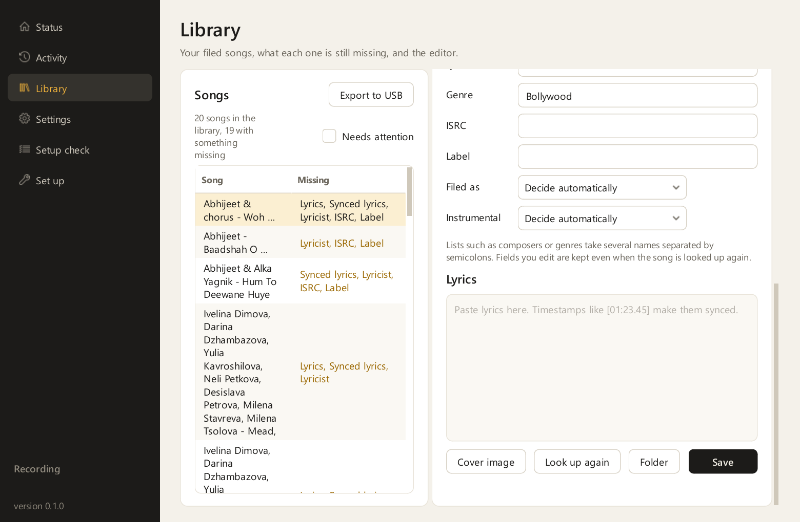
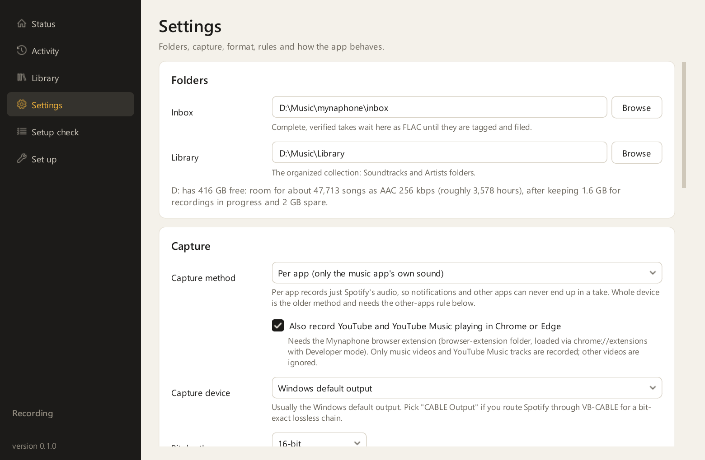
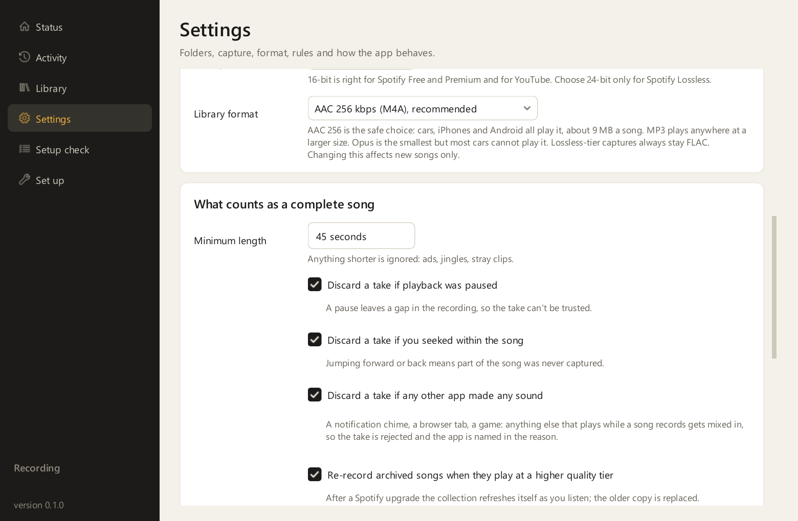
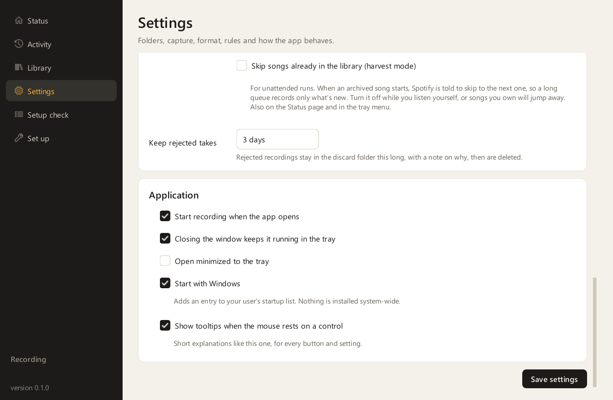
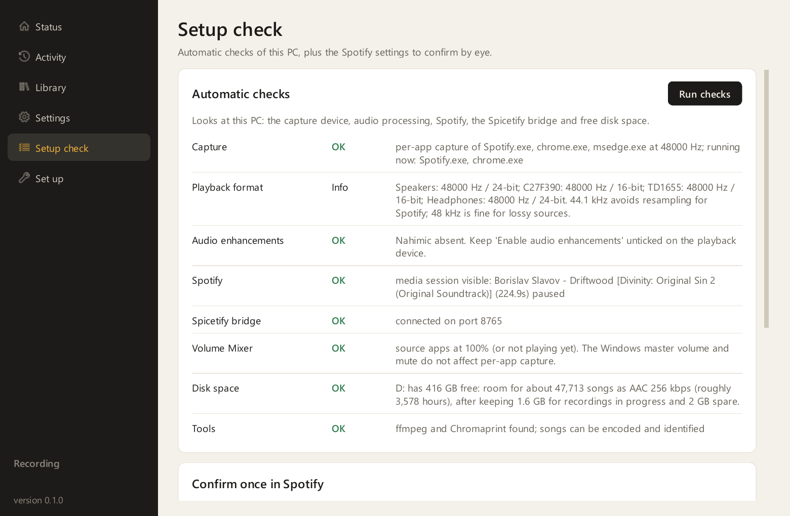
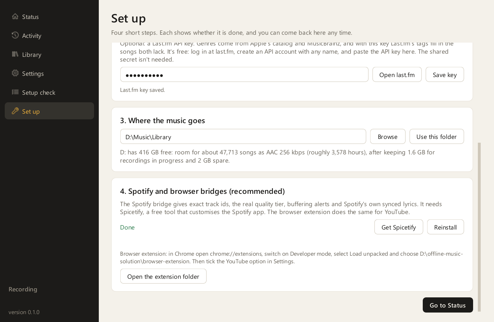
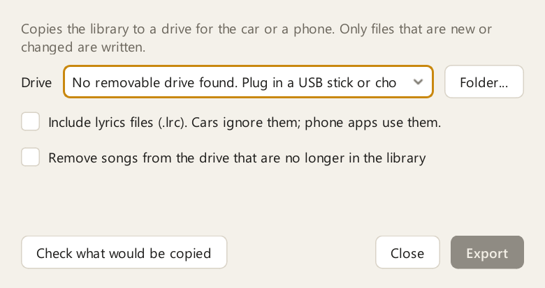
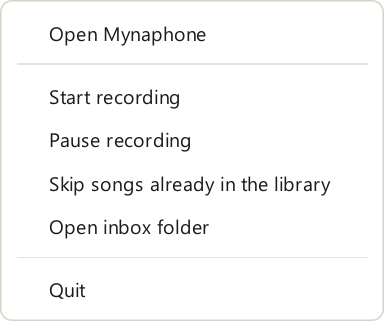

# The window and the tray

This page describes every page of Mynaphone's window, the tray icon and its menu, and the export
dialog. For step-by-step tasks, see [Using Mynaphone](using.md).

The window has a sidebar with 6 pages. Under the pages, the sidebar shows the recorder's state
(Stopped, Listening, Paused or Recording), "Harvest mode on" when harvest mode is on, and the version.
Rest the mouse on any button or setting for a short explanation; **Show tooltips** in Settings turns
those off.

| Page | What it's for |
|---|---|
| [Status](#status) | What the recorder is doing right now, the counts, and the last few takes |
| [Activity](#activity) | Every take with its verdict and reason, and the live log |
| [Library](#library) | Your filed songs, what each one is missing, and the editor |
| [Settings](#settings) | Folders, capture, format, rules and how the app starts |
| [Setup check](#setup-check) | Automatic checks of the PC, and the Spotify settings to confirm by eye |
| [Set up](#set-up) | The first-run steps, kept for later |

## Status

The top card shows the song being recorded.

| Part | What it shows or does |
|---|---|
| State pill | Stopped, Listening, Recording or Paused |
| Cover, title and artist | The song being recorded, with its album. With no song, the myna mark in the recorder's state |
| Progress line and time | How far into the song the take is, against the song's length |
| **Start** / **Stop** | Starts or stops the recorder. Stopping ends a take in progress, which is then discarded |
| **Pause** / **Resume** | Keeps listening but starts no new take until you resume. A take already running carries on |
| Capture line | The capture method, the sample rate, and whether the Spotify bridge is connected |
| **Skip songs already in the library** | Harvest mode. When an archived song starts, Spotify is told to skip to the next one |

Under the card, 4 counts:

| Count | Meaning |
|---|---|
| Waiting in the inbox | Kept takes not yet identified and filed, for example while the internet is down |
| In the library | Songs filed in your library |
| Discarded | Takes that failed a check |
| Skipped | Songs that weren't recorded, for example because they were already in the library, longer than 15 minutes, or played before capture was running |

**Recent** lists the last 6 takes. **See all activity** opens the Activity page.

## Activity

**Takes** lists every take, newest first, with the inbox and library counts at the top right.

| Column | What it shows |
|---|---|
| Time | When the take started |
| Song | Artist and title as the source app reported them |
| Result | Kept, Discarded, Skipped or Filed |
| Detail | For Kept, the recorded length against the song's length and the quality tier. For Discarded or Skipped, the reason; rest the mouse on it for the full list. For Filed, the place in the library, how the song was identified and what's still missing |

**Log** shows the recorder's log as it's written, for the current session. The full log is in the
log folder, `D:\Music\mynaphone\logs` by default.

## Library

On the left, **Songs** lists every filed song with what it's still missing. "Complete" means nothing
is missing.

| Control | What it does |
|---|---|
| Song count | How many songs are in the library and how many have something missing |
| **Needs attention** | Lists only songs with something missing, including those in `Unsorted` |
| **Export to USB** | Opens the [export dialog](#export-to-usb-dialog) |

On the right, the editor shows the selected song: its cover, its path inside the library, the list
of missing details, and every field.

| Field | What to enter |
|---|---|
| Title, Artist, Album, Album artist | Text. For a film song, the singers go in Artist and the music director in Album artist |
| Year, Track number, Track count, Disc number, Disc count | Numbers |
| Composer, Lyricist, Genre | One or more names, separated by semicolons |
| ISRC, Label | Text |
| **Filed as** | Decide automatically, Soundtrack, Album, Single or Compilation. Sets the folder layout |
| **Instrumental** | Decide automatically, Yes, no vocals, or No, it has vocals. An instrumental needs no lyrics or lyricist |
| **Lyrics** | Plain lyrics, or synced lyrics with timestamps such as `[01:23.45]` at the start of each line |

A field you edit gets a blue border, and later lookups never overwrite it.

| Button | What it does |
|---|---|
| **Cover image** | Choose a picture file as the song's cover |
| **Look up again** | Fingerprint the file again and query AcoustID, MusicBrainz and the lyrics sources, keeping your edits |
| **Folder** | Open the folder that holds the file in File Explorer |
| **Save** | Write your changes into the file's tags, and move the file if its folder name changed |

## Settings

The Settings page is one long scrolling page in 4 cards. Select **Save settings** at the bottom to
keep your changes. The [settings reference](settings.md) has every setting with its default and the
matching line in `config.toml`.

| Card | What's in it |
|---|---|
| Folders | The inbox and library folders, and how many songs fit on the library's drive |
| Capture | Capture method, YouTube recording, capture device, bit depth and library format |
| What counts as a complete song | Minimum length, the discard rules, re-recording at a higher tier, harvest mode and how long rejected takes are kept |
| Application | How the app starts, closes and shows tooltips |

## Setup check

**Run checks** looks at the PC and lists one line per check, each marked OK, Info, Check or Problem.

| Check | What it looks at |
|---|---|
| Capture | Whether per-app capture can attach to each source app, and which ones are running |
| Playback format | Each output device's sample rate and bit depth |
| Audio enhancements | Audio processing such as Nahimic that alters the sound before capture |
| Spotify | Whether Spotify reports what it's playing to Windows |
| Spicetify bridge | Whether the Spotify bridge is installed and connected |
| Volume Mixer | Whether each source app's slider in the Windows Volume Mixer is at 100 % |
| Disk space | Free space on the library's and inbox's drives, and how many songs fit |
| Tools | Whether ffmpeg and Chromaprint are present |

**Confirm once in Spotify** lists the Spotify settings that can't be read from outside the app.
[Step 7 of the install guide](install.md#step-7-run-the-setup-check) has the table.

## Set up

The first-run page, with 4 numbered cards. Each one shows Done when finished. The window opens on
this page until the tools are in place and the AcoustID key is saved, and it stays in the sidebar afterwards.
[Step 4 of the install guide](install.md#step-4-start-the-app-and-open-the-set-up-page) describes
each card.

## Export to USB dialog

| Control | What it does |
|---|---|
| Drive | The removable drives plugged in. **Folder...** picks any folder instead, for example a phone's music folder |
| **Include lyrics files (.lrc)** | Also copies the `.lrc` file next to each song. Cars ignore them; phone apps use them |
| **Remove songs from the drive that are no longer in the library** | Makes the drive an exact mirror of the library |
| **Check what would be copied** | Shows how many files would be copied and how much space they need, how many are already up to date and how many would be removed, without writing anything |
| **Export** | Copies new and changed files |

## The tray icon and its menu

Mynaphone keeps running in the notification area when you close the window. The myna's eye shows
the recorder's state.

| Icon | State |
|---|---|
|  | Stopped |
|  | Listening for a song |
|  | Recording a song |
|  | Paused |

Click the icon to show or hide the window. Right-click it for the menu.

| Menu item | What it does |
|---|---|
| **Open Mynaphone** | Brings the window back |
| **Start recording** / **Stop recording** | Same as **Start** and **Stop** on the Status page |
| **Pause recording** | Same as **Pause** on the Status page |
| **Skip songs already in the library** | Turns harvest mode on or off |
| **Open inbox folder** | Opens the inbox in File Explorer |
| **Quit** | Stops the recorder and closes Mynaphone |
